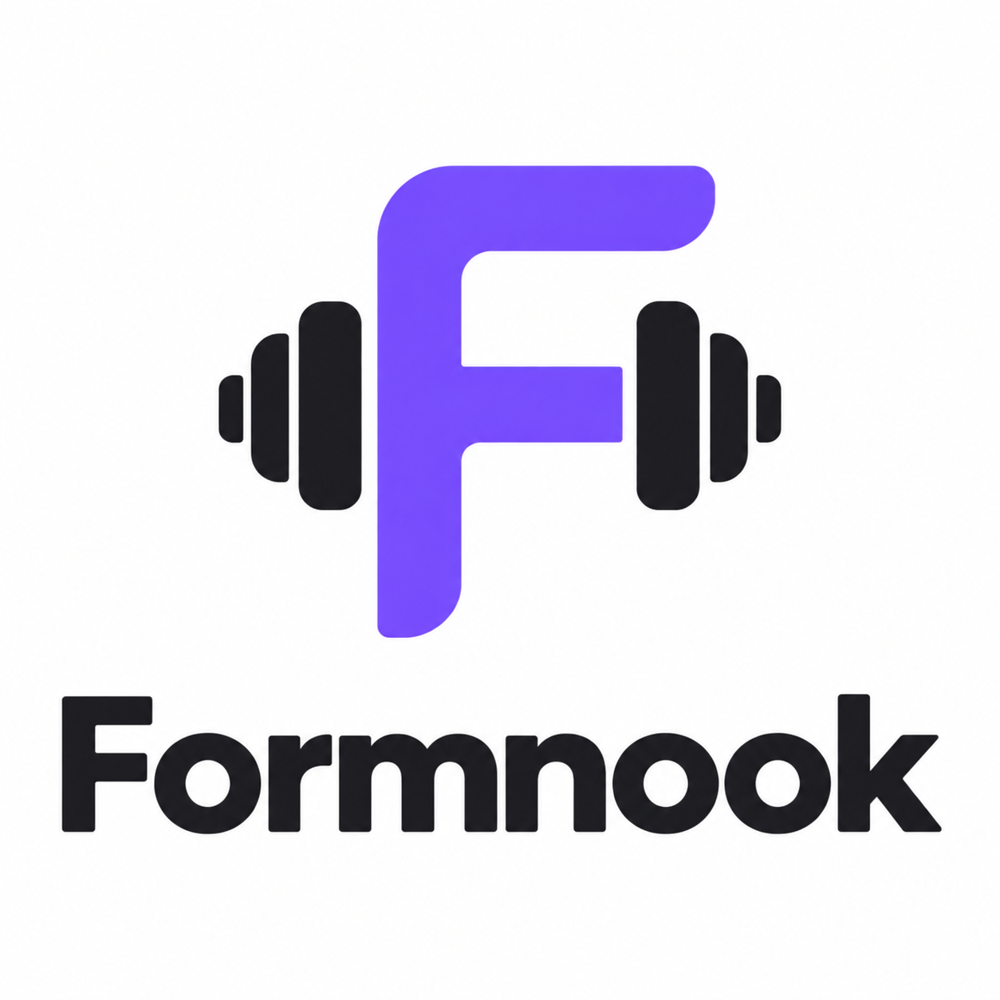
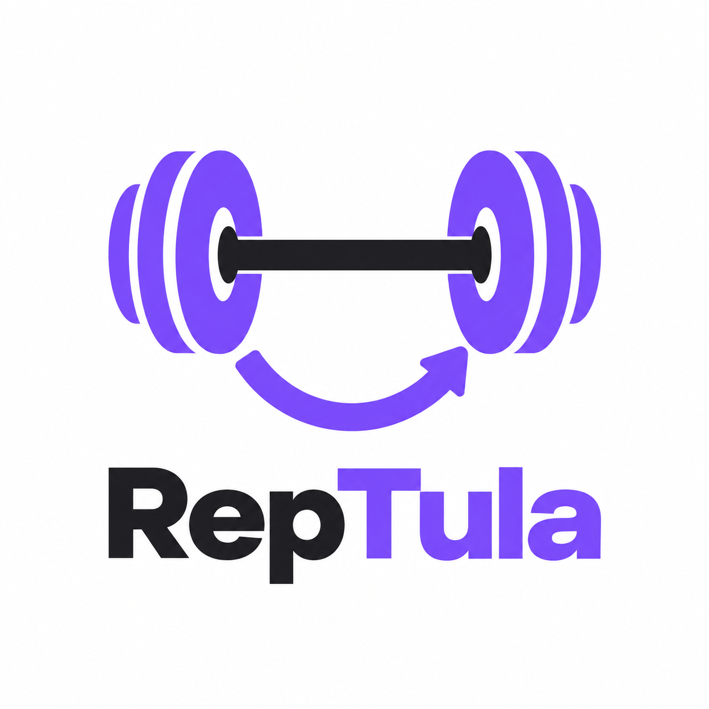
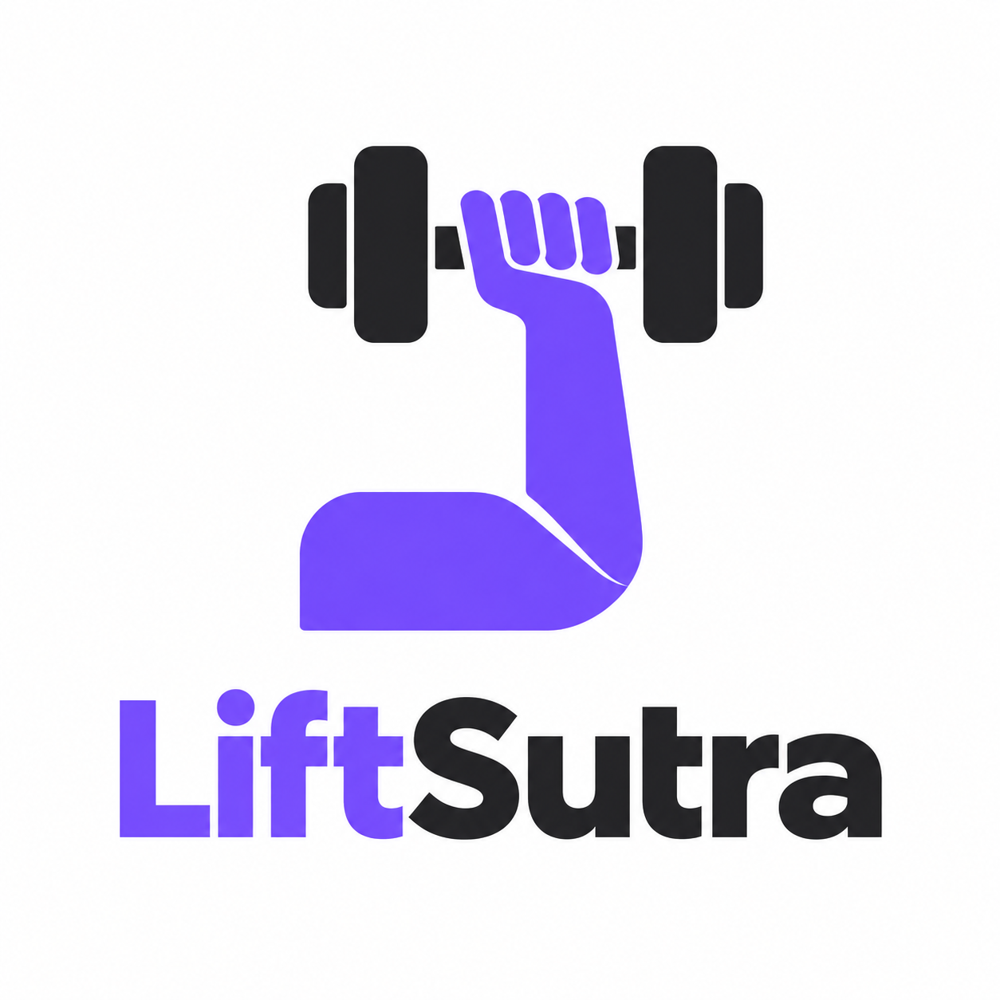
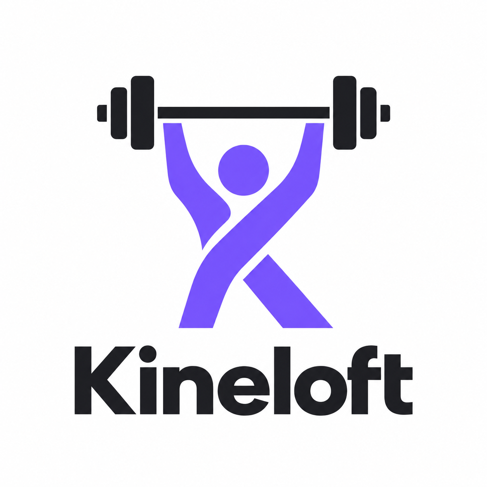
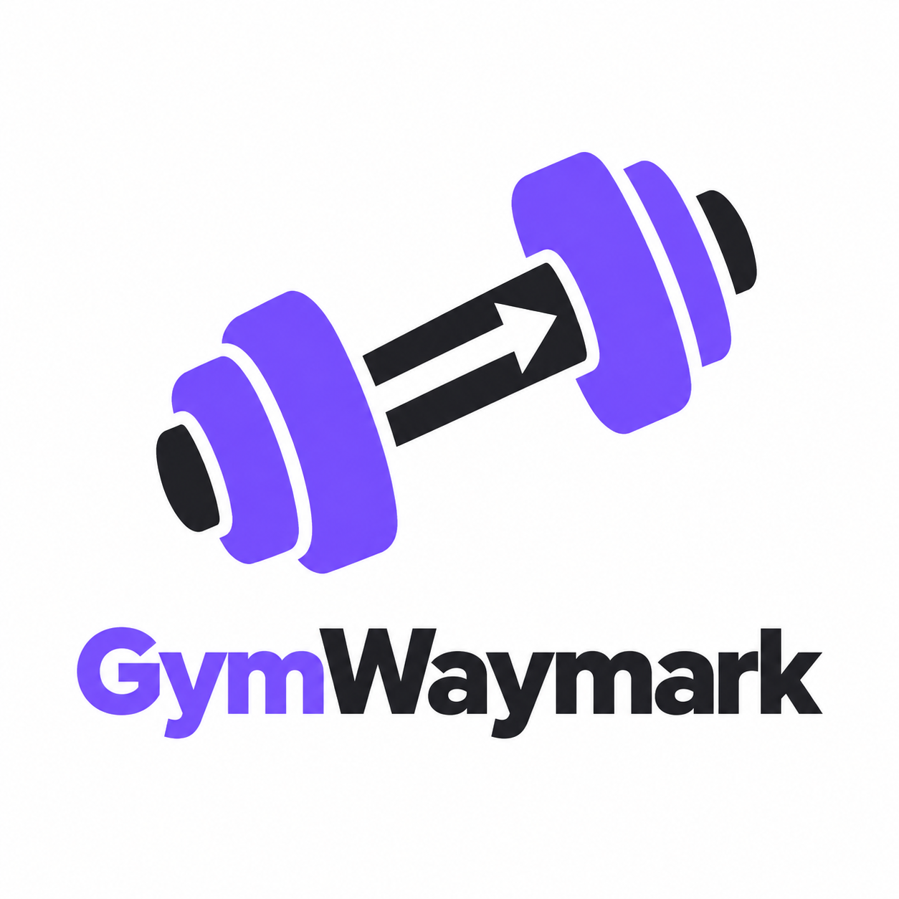
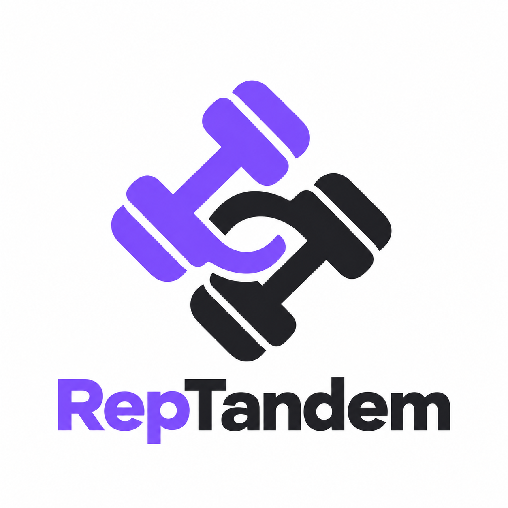

# Gym identity concepts — round 2

Generated using the built-in image-generation tool. Drafts for review, not a final name or trademark clearance. No app branding has been changed in this round.

The home coach is a new person based on the original reference's upbeat raised-dumbbell and thumbs-up pose. The PNG alpha channel is retained.

## coach-v2

### Generation prompt

Use case: ads-marketing. Image 1 is a POSE AND MOOD REFERENCE, not the person to copy. Generate a NEW fictional adult male gym coach cutout with a different face and hairstyle, keeping the same upbeat smiling energy and close waist-up composition: big natural cheerful grin, slightly raised playful eyebrow, right elbow bent holding a black dumbbell near shoulder height, left hand giving a confident thumbs-up. Friendly and a little cheeky, not stiff or serious, not goofy clownish. Fit approachable build, wearing a light lavender athletic t-shirt with simple dark piping at sleeves, no logos. Photorealistic editorial fitness photography, natural skin texture, bright soft light. Waist-up only so face and dumbbell read clearly in a small mobile banner. Keep entire hair, head, both elbows, thumb and entire dumbbell visible with small clear margin, not a full-body standing portrait. Output genuine TRANSPARENT BACKGROUND PNG with alpha, isolated silhouette, no backdrop, no painted checkerboard, no ground, no text, no watermark. Matches a modern purple gym app.

## 01-formnook

### Generation prompt

Use case: logo-brand. Create ONE original professional gym workout guidance app logo concept, centered on a PURE OPAQUE WHITE background. Flat crisp vector-style artwork, purple #7C4DFF and charcoal #1E1E22, strong silhouette, suitable for a tiny app icon. Immediately recognizable as exercise/strength training, not generic software. One large symbol above the exact brand wordmark in bold contemporary sans serif. Generous whitespace. No glow, no gradients, no 3D, no mockups, no shadows, no extra slogans, no mascots, no existing brand imitation. Text verbatim: "Formnook". Symbol: cleverly combine a clearly recognizable compact dumbbell with an F-shaped training-path monogram. The horizontal arms of the F suggest the dumbbell handle and plates; retain recognisable gym equipment. Friendly confident rounded geometry, one cohesive symbol, not multiple unrelated icons.

## 02-reptula

### Generation prompt

Use case: logo-brand. Create ONE original professional gym workout guidance app logo concept, centered on a PURE OPAQUE WHITE background. Flat crisp vector-style artwork, purple #7C4DFF and charcoal #1E1E22, strong silhouette, suitable for a tiny app icon. Immediately recognizable as exercise/strength training, not generic software. One large symbol above the exact brand wordmark in bold contemporary sans serif. Generous whitespace. No glow, no gradients, no 3D, no mockups, no shadows, no extra slogans, no mascots, no existing brand imitation. Text verbatim: "RepTula". Symbol: a bold horizontal barbell balanced between two circular weight plates, with one short curved repetition arc underneath integrating into the mark. Symmetric controlled strength and balanced repetitions. Distinctive circular silhouette; flat purple plates, charcoal bar, no delicate details.

## 03-liftsutra

### Generation prompt

Use case: logo-brand. Create ONE original professional gym workout guidance app logo concept, centered on a PURE OPAQUE WHITE background. Flat crisp vector-style artwork, purple #7C4DFF and charcoal #1E1E22, strong silhouette, suitable for a tiny app icon. Immediately recognizable as exercise/strength training, not generic software. One large symbol above the exact brand wordmark in bold contemporary sans serif. Generous whitespace. No glow, no gradients, no 3D, no mockups, no shadows, no extra slogans, no mascots, no existing brand imitation. Text verbatim: "LiftSutra". Symbol: a powerful but simple L-shaped bent forearm gripping a small dumbbell, drawn as one clean continuous geometric ribbon. Clearly gym lifting yet elegant and minimal, no anatomical muscles, no clenched-fist political imagery, no religious symbols. Keep dumbbell unmistakable.

## 04-kineloft

### Generation prompt

Use case: logo-brand. Create ONE original professional gym workout guidance app logo concept, centered on a PURE OPAQUE WHITE background. Flat crisp vector-style artwork, purple #7C4DFF and charcoal #1E1E22, strong silhouette, suitable for a tiny app icon. Immediately recognizable as exercise/strength training, not generic software. One large symbol above the exact brand wordmark in bold contemporary sans serif. Generous whitespace. No glow, no gradients, no 3D, no mockups, no shadows, no extra slogans, no mascots, no existing brand imitation. Text verbatim: "Kineloft". Symbol: a minimal abstract human figure performing an overhead barbell press, dot head and two strong rising arms forming a subtle K-like motion structure beneath the barbell. Bold balanced athletic silhouette, welcoming not bodybuilding macho. Simple flat solid shapes.

## 05-gymwaymark

### Generation prompt

Use case: logo-brand. Create ONE original professional gym workout guidance app logo concept, centered on a PURE OPAQUE WHITE background. Flat crisp vector-style artwork, purple #7C4DFF and charcoal #1E1E22, strong silhouette, suitable for a tiny app icon. Immediately recognizable as exercise/strength training, not generic software. One large symbol above the exact brand wordmark in bold contemporary sans serif. Generous whitespace. No glow, no gradients, no 3D, no mockups, no shadows, no extra slogans, no mascots, no existing brand imitation. Text verbatim: "GymWaymark". Symbol: a diagonal dumbbell whose handle contains a simple forward direction arrow in negative space. Fitness equipment and confident guidance immediately readable together. Compact slanted mark, chunky gym plates, precise minimal geometry. Wordmark must remain legible despite longer name.

## 06-reptandem

### Generation prompt

Use case: logo-brand. Create ONE original professional gym workout guidance app logo concept, centered on a PURE OPAQUE WHITE background. Flat crisp vector-style artwork, purple #7C4DFF and charcoal #1E1E22, strong silhouette, suitable for a tiny app icon. Immediately recognizable as exercise/strength training, not generic software. One large symbol above the exact brand wordmark in bold contemporary sans serif. Generous whitespace. No glow, no gradients, no 3D, no mockups, no shadows, no extra slogans, no mascots, no existing brand imitation. Text verbatim: "RepTandem". Symbol: two offset interlocking compact dumbbells forming one rounded linked mark, suggesting training together and sequential sets. Exactly two recognizable dumbbells, balanced positive and negative space, no chains with many links. Bold sport identity, approachable rounded corners.

